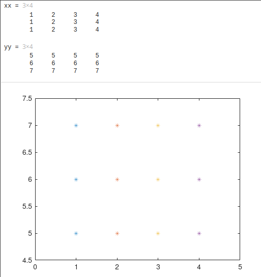

### Graphing in MATLAB
#### Basic Functions
`plot(x,y)` can accept a third argument, which changes the style of the line

`subplot(a,b,c)` lets you have several plots at once, where `a` is the number of files, `b` is the number of columns, and `c` is the location of the current plot.

#### 2D Graphs
The easiest way to graph in 2D is with `plot(x,y)`, where `x` and `y` are two same sized vectors.

```
x = 0:0.1:20;
y = exp(-x/10).*sin(x);
plot(x,y), grid on, xlabel("x"), ylabel("f(x)=e^(-x/10)sin(x)"), title("A simple plot")
```

This creates a graph of $e^{-x/10}\times \sin(x)$, with a grid, axis labels, and a title.

`a = linspace(x,y,z)` is another function to create your range of values, starting from `x`, ending at `y`, with `z` number of slices.

#### 3D Graphs
To create a single variable graph in 3D, we create a vector and 2 separate functions:
```
clear, clc;
t=-20:0.1:20;
x=t.^2+t;
y=t.^3+t.^2+t+1;
z=t;
%plot3(x,y,z);
comet3(x,y,z);
grid on
```

In this example `comet(x,y,z)` creates an animation, as `t` increases.

To graph surfaces, we use `surf(x,y,z)` or `mesh(x,y,z)`, where `x`, `y`, and `z` are the coordinates of each point on the surface.

`meshgrid(x,y)` creates a grid that maps each element from a vector to each element of another vector, or each element of a vector to itself. This allows us to graph surfaces.
```
x=[1 2 3 4]
y=[5 6 7]
[xx yy] = meshgrid(x,y)
axis([0 5 4.5 7.5])
```


```
x = linspace(-1,1,50);
y = x;
a = 3;
c = .5;
[xx yy] = meshgrid(x,y)
z=c*sin(2*pi*a*sqrt(xx.^2+yy.^2));
surf(xx, yy, z)
colorbar;
xlabel("x");
ylabel("y");
zlabel("z");
figure;
```

#matlab #programming 
