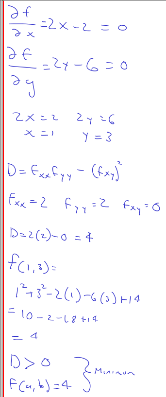

### Maximums and Minimums
These points can be categorized as local or absolute. A local point is the highest/lower point for a specific area, and an absolute point is the highest/lowest point for the entire function. These points are called critical points.

There are also other critical points that aren't maximums or minimums, called saddle points.

To find the maximum and minimum of a [multivariable function](multivariable-functions.md), first we find the points where the [partial derivatives](partial-derivatives.md) are equal to $0$.

$$
\begin{align}
		\frac{\partial f}{\partial x}(a,b)=0 \\ &&&&
		D_uf(a,b)=0 \\
		\frac{\partial f}{\partial y}(a,b)=0 \\
\end{align}
$$

[Remembering that](directional-derivative.md):
$$
D_uf(a,b)=\frac{\partial f}{\partial x}(a,b)\cos\theta+\frac{\partial f}{\partial y}(a,b)\sin\theta
$$
This is obtained by solving the system of equations produced by the partial derivatives. Each pair of solutions are the coordinates for each critical point.

For each critical point, we must find the __determinant__ using the second derivative of the function.
$$
D=f_{xx}f_{yy}-(f_{xy})^2
$$
Given $D$, we can determine what kind of critical point we have:
- If $D>0$ and $f_{xx}(a,b)>0$, then the point is a relative minimum.
- If $D>0$ and $f_{xx}(a,b)<0$, then the point is a relative maximum.
- If $D<0$, then the point is a saddle point. Notice that we don't need to evaluate $f_{xx}(a,b)$.
- If $D=0$, then our result is indeterminate.

#### Determinant
When we find the value of $D$, what we're actually calculating is:
- $f_{xx}$ is the concavity of the function in the $x$ direction.
- $f_{yy}$ is the concavity of the function in the $y$ direction.
- $(f_{xy})^2$ is how close to an inflection point the function is.

##### Example
Let $f(x,y)=x^2+y^2-2x-6y+14$, find the maximums and minimums of the function.

#math #calculus 
